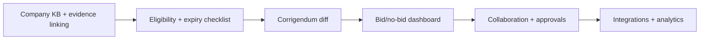

# RFQ/RFP Document Intelligence Platform  
## Client Requirements & Commercial Proposal

**Document version:** 1.1  
**Date:** 23 June 2026  
**Status:** Draft for client review  
**Prepared for:** [Client name]  
**Prepared by:** [Your organization]

---

## 1. Executive Summary

This document defines the functional, technical, and commercial requirements for an **enterprise RFQ/RFP Document Intelligence Platform** — a system that ingests tender documents, extracts structured procurement intelligence, and accelerates **technical and commercial proposal** creation with full source traceability.

The platform is designed for procurement and bid teams who need to:

- Understand complex RFPs quickly and accurately
- Decide bid/no-bid with evidence
- Draft evaluator-grade technical and commercial proposals
- Maintain a reusable **company knowledge base** aligned to tender requirements

A working proof-of-concept (POC) already demonstrates upload, parsing, grounded summarization, document-scoped chat, technical proposal generation, and a deterministic commercial proposal engine. This requirements document extends that foundation with **knowledge-base-driven eligibility**, **document lifecycle management**, **risk intelligence**, and a clearly defined **Contextual Learning** approach (not traditional model training).

---

## 2. Business Objectives

| Objective | Success measure |
|-----------|-----------------|
| Reduce time-to-understanding for new tenders | Briefing available within minutes of upload vs. days of manual reading |
| Improve bid quality and compliance | Compliance matrix coverage; fewer missed mandatory items |
| Enable faster proposal drafting | Draft technical + commercial volumes from structured extractions + company KB |
| Support bid/no-bid decisions | Eligibility score, gap checklist, risk register with mitigations |
| Maintain auditability | Every claim traceable to RFP page/section or company KB source |
| Control AI cost and risk | No fine-tuning; knowledge and prompts updated via Contextual Learning |

---

## 3. Scope Overview

### 3.1 In scope

- Tender document ingestion (PDF, DOCX), versioning, and parsing
- AI-powered procurement briefing and structured extraction
- Document-scoped RAG chat with citations
- Technical proposal generation (evidence-backed)
- Commercial proposal generation (deterministic pricing + LLM narratives)
- **Company Knowledge Base** (policies, certifications, case studies, rate cards, statements)
- **Document expiration & validity tracking**
- **Eligibility assessment** against tender requirements + company KB
- **Risk & concern analysis** with mitigation recommendations
- **Contextual Learning** framework for continuous improvement without model retraining
- User interface, APIs, PDF exports, and operational monitoring
- **Platform enhancement roadmap** (decision intelligence, collaboration, integrations, analytics) — see §7

### 3.2 Out of scope (initial release)

- Reinforcement learning or custom foundation-model training from scratch
- Fully autonomous proposal submission without human review
- Legal contract negotiation or e-signature workflows
- Integration with every third-party ERP/CRM (available as phased add-on)

---

## 4. Current Capabilities (Baseline — Delivered in POC)

The following capabilities are implemented or in active POC and form the **baseline** for this engagement.

### 4.1 Document intake & processing

| ID | Capability | Description |
|----|------------|-------------|
| B-01 | Multi-format upload | PDF and DOCX upload with validation, size limits, and SHA-256 deduplication |
| B-02 | Async processing pipeline | Celery-based pipeline with granular stage tracking and partial recovery |
| B-03 | Tender versioning | Tender lineage: original, revision, corrigendum, clarification; `is_current` flag |
| B-04 | Document parsing | Page-level text, section detection, table extraction, layout structure |
| B-05 | OCR fallback | Tesseract-based OCR for scanned PDFs (optional) |
| B-06 | Processing status & audit | Per-stage logs, structured error taxonomy, job retry semantics |

### 4.2 Procurement intelligence (Phase 3)

| ID | Capability | Description |
|----|------------|-------------|
| B-07 | Section-aware chunking | Semantic chunks aligned to document structure |
| B-08 | Focused extraction | Nine procurement categories: eligibility, deadlines, technical requirements, scope, payment, penalties/risks, mandatory documents, evaluation criteria |
| B-09 | Grounded briefing | Seven-section executive briefing with page/section citations |
| B-10 | Source traceability | `SourceReference` records for every extracted item |
| B-11 | Regeneration | Re-run extraction/summary after prompt or document updates |
| B-12 | PDF export | Full and executive briefing PDF variants |

### 4.3 Document-scoped chat (Phase 4)

| ID | Capability | Description |
|----|------------|-------------|
| B-13 | Vector indexing | Chroma + OpenAI embeddings (`text-embedding-3-small`) |
| B-14 | Grounded Q&A | Answers limited to retrieved document excerpts; explicit "not found" when unsupported |
| B-15 | Chat sessions | Multi-turn conversations with citation display |

### 4.4 Proposal generation

| ID | Capability | Description |
|----|------------|-------------|
| B-16 | Technical proposal draft | Requirement registry, capability matching, gap detection, compliance matrix, PDF export |
| B-17 | Commercial proposal engine | Deterministic pricing engine; LLM writes narratives only — **never computes prices** |
| B-18 | Commercial workbench | Gap-driven questionnaire, editable pricing tables, assumptions, exclusions, validation |
| B-19 | Bidder/vendor profile | Structured profile for credentials, team, projects, rate cards |
| B-20 | Draft disclaimers | Watermarks and banners: all outputs require human review before submission |

---

## 5. New Functional Requirements

### 5.1 Document expiration & validity detection

**Requirement ID:** FR-01  
**Priority:** High  
**Depends on:** B-01, B-08

#### Description

The system shall detect, extract, and monitor **expiration and validity dates** across tender documents and company knowledge-base documents.

#### Functional requirements

| ID | Requirement |
|----|-------------|
| FR-01.1 | Extract expiration, validity, and "valid until" dates from uploaded RFPs, corrigendums, and KB documents using structured extraction |
| FR-01.2 | Classify document types that commonly expire: certifications (ISO, CMMI), insurance policies, financial statements, licenses, registrations, experience letters |
| FR-01.3 | Store normalized expiry metadata per document and per extracted entity (e.g., "ISO 27001 certificate — expires 2027-03-15") |
| FR-01.4 | Display dashboard alerts: **Expired**, **Expiring within 30/60/90 days**, **Valid** |
| FR-01.5 | Block or warn during proposal generation when mandatory KB evidence is expired or will expire before tender submission deadline |
| FR-01.6 | Support manual override with audit note when client accepts expired evidence temporarily |
| FR-01.7 | Re-evaluate expiry status on document re-upload or KB refresh |

#### Acceptance criteria

- User sees expiry status on document detail and KB asset views
- Proposal generation flags expired certifications referenced in compliance matrix
- Notification list exportable (CSV/PDF) for compliance teams

---

### 5.2 Company Knowledge Base

**Requirement ID:** FR-02  
**Priority:** Critical  
**Depends on:** B-16, B-17

#### Description

A centralized, organization-scoped **Company Knowledge Base (CKB)** stores policies, standard statements, certifications, case studies, team profiles, rate cards, boilerplate narratives, and other assets required to build **technical and commercial proposals** at proposal-creation time.

#### Functional requirements

| ID | Requirement |
|----|-------------|
| FR-02.1 | CKB organized by categories: Policies, Certifications, Financial Statements, Case Studies / References, Team & CVs, Technical Methodologies, Commercial Rate Cards, Legal/Compliance Statements, HSE, Insurance, Past Proposals (reference) |
| FR-02.2 | Each KB item has: title, category, tags, effective date, expiry date, version, source file, approval status, owner |
| FR-02.3 | Full-text indexing and semantic search across CKB (embeddings) for retrieval during proposal and eligibility flows |
| FR-02.4 | Link KB items to tender requirements during proposal generation (evidence mapping) |
| FR-02.5 | Version control: superseded items retained for audit; `is_current` marks active version |
| FR-02.6 | Role-based access: upload, approve, read-only per category |
| FR-02.7 | Bulk import (ZIP/folder) and API ingestion for integration with DMS/SharePoint (phased) |
| FR-02.8 | CKB content injected into technical proposal synthesis as **vendor evidence** (replacing profile-only limitation) |
| FR-02.9 | CKB content injected into commercial proposal: rate cards, standard terms, assumptions templates |
| FR-02.10 | Mandatory document checklist per tender type configurable by admin (e.g., "ISO 9001", "Audited financials last 3 years") |

#### Acceptance criteria

- Bid manager can attach KB evidence to compliance matrix rows
- Technical proposal sections cite KB source IDs, not invented credentials
- Commercial pricing pulls from approved rate cards when available

---

### 5.3 Eligibility assessment & gap checklist

**Requirement ID:** FR-03  
**Priority:** Critical  
**Depends on:** FR-02, B-08, B-16

#### Description

Using tender extractions (especially eligibility criteria and mandatory documents) cross-referenced against the Company Knowledge Base, the system shall determine **bid eligibility**, highlight **gaps**, and produce an actionable **checklist**.

#### Functional requirements

| ID | Requirement |
|----|-------------|
| FR-03.1 | Parse eligibility criteria into discrete, testable requirements (turnover thresholds, years of experience, certifications, geography, consortium rules, etc.) |
| FR-03.2 | Map each requirement to CKB evidence automatically where semantic/factual match exists |
| FR-03.3 | Produce eligibility verdict: **Eligible**, **Conditionally eligible**, **Not eligible** with confidence score |
| FR-03.4 | Generate gap checklist: missing documents, expired items, unmet thresholds, ambiguous criteria requiring human judgment |
| FR-03.5 | Each gap item includes: requirement text, RFP citation, severity (blocker / warning / info), suggested remediation, responsible role |
| FR-03.6 | Support manual attestation: user marks requirement as "will obtain" / "not applicable" with justification |
| FR-03.7 | Export eligibility report (PDF/Excel) for bid committee review |
| FR-03.8 | Gate proposal generation: optional org policy to block generation when critical blockers exist |
| FR-03.9 | Track checklist completion % over time per tender |

#### Acceptance criteria

- Eligibility report generated within 2 minutes of briefing completion for typical RFP (≤200 pages)
- 100% of extracted eligibility items appear in checklist (none silently dropped)
- User can drill from gap item to RFP source page and KB search results

---

### 5.4 Risk & concerns analysis with mitigation

**Requirement ID:** FR-04  
**Priority:** High  
**Depends on:** B-08, B-16, FR-03

#### Description

Extend procurement risk extraction into a structured **Risk Register** covering procurement/legal risks, operational risks, commercial risks, and delivery risks — each with **mitigation strategies** grounded in RFP text and company KB.

#### Functional requirements

| ID | Requirement |
|----|-------------|
| FR-04.1 | Classify risks: Legal/Contractual, Financial/Payment, Operational/Delivery, Compliance/Regulatory, Reputational, Resource/Staffing, Technology, Subcontractor |
| FR-04.2 | Assign severity (Critical / High / Medium / Low) and likelihood where inferable from RFP |
| FR-04.3 | Link each risk to RFP citation (clause, page, section) |
| FR-04.4 | Generate mitigation recommendations: contractual (qualification), operational (process), commercial (pricing buffer), insurance, staffing |
| FR-04.5 | Distinguish **procurement/legal risks** (penalties, LDs, termination) from **operational risks** (manpower, SLA, geography) |
| FR-04.6 | Include risks in technical proposal "Risks & Mitigations" section with evidence-backed mitigations from CKB where applicable |
| FR-04.7 | Bid/no-bid risk summary: top 5 risks for executive decision |
| FR-04.8 | User can edit, accept, reject, or add custom risks; changes audited |
| FR-04.9 | Risk heat map visualization on tender dashboard |

#### Acceptance criteria

- Risk register populated from extractions + LLM synthesis pass with mandatory citations
- No mitigation claims company capabilities not present in CKB or bidder profile without `[TO BE COMPLETED]` flag
- Exportable risk register aligned to proposal section structure

---

### 5.5 Contextual Learning (learning model definition)

**Requirement ID:** FR-05  
**Priority:** High  
**Applies to:** Entire platform

#### Description

The platform does **not** implement reinforcement learning (RL) or train foundation models from scratch. Instead, it uses **Contextual Learning** — a controlled, auditable approach where system behavior improves by updating **knowledge** and **prompts**, not model weights.

#### 5.5.1 What Contextual Learning is

| Aspect | Contextual Learning (our approach) | Traditional model training (out of scope) |
|--------|-----------------------------------|----------------------------------------|
| Model weights | Fixed — use commercial LLMs (e.g., GPT-4o) via API | Retrained or fine-tuned on proprietary data |
| Knowledge updates | Add/update CKB documents, embeddings, structured rules | Requires retraining cycles |
| Behavior tuning | Versioned prompt templates, extraction schemas, validation rules | RLHF, fine-tuning, custom checkpoints |
| Auditability | Full trace: which KB version + prompt version produced output | Opaque weight changes |
| Cost profile | Predictable API usage | High GPU, MLOps, data labeling |
| Time to improve | Hours (upload KB + deploy prompt vNext) | Weeks to months |

#### 5.5.2 Contextual Learning components

| Component | Purpose |
|-----------|---------|
| **Knowledge layer** | Company KB, tender extractions, embeddings index — retrievable context at inference time |
| **Prompt layer** | Versioned prompts (`v4.4.1`, `PROPOSAL_PROMPT_VERSION`, etc.) with changelog |
| **Rule layer** | Deterministic engines: pricing, eligibility thresholds, validators, compliance downgrades |
| **Feedback layer** | User corrections stored as structured feedback → inform prompt/KB updates (not weight updates) |
| **Retrieval layer** | RAG retrieval policies (top-K, score thresholds, section-aware chunking) |

#### 5.5.3 Functional requirements

| ID | Requirement |
|----|-------------|
| FR-05.1 | All AI outputs record `prompt_version`, `model_id`, and `kb_snapshot_version` in metadata |
| FR-05.2 | Admin can publish new prompt versions without code deploy (configuration-driven where possible) |
| FR-05.3 | User feedback (thumbs down, correction notes) captured per extraction/proposal section |
| FR-05.4 | Feedback reviewed periodically to update prompts and KB — documented change log |
| FR-05.5 | No RL, fine-tuning, or custom model training in scope unless separately contracted |
| FR-05.6 | Documentation and client training explicitly state Contextual Learning boundaries |

#### Acceptance criteria

- Client stakeholders can explain the approach: "We improve by updating knowledge and instructions, not retraining the AI model"
- Metadata on any generated artifact shows prompt and KB versions used

---

## 6. Additional Offerings

Beyond core requirements, the following capabilities can be delivered as **included enhancements** or **optional modules**.

### 6.1 Recommended included in enterprise rollout

| Offering | Description | Value |
|----------|-------------|-------|
| **Multi-user RBAC & SSO** | Azure AD / Okta integration, role-based permissions per tender and KB category | Enterprise security compliance |
| **Tender portfolio dashboard** | All active tenders, deadlines, eligibility status, risk heat maps | Executive visibility |
| **Corrigendum diff intelligence** | Compare tender versions; highlight changed requirements, deadlines, scope | Avoid stale bids after amendments |
| **Human review workflow** | Assign reviewers, approval gates before PDF export | Quality control |
| **Audit & export pack** | Full audit trail: uploads, AI runs, edits, exports for compliance | Regulatory readiness |
| **Email / Teams notifications** | Deadline reminders, expiry alerts, generation complete | Operational efficiency |

### 6.2 Optional add-on modules

| Module | Description | Indicative effort |
|--------|-------------|-------------------|
| **DMS integration** | SharePoint, Google Drive, or client DMS sync for CKB | Medium |
| **CRM / ERP connector** | Pull rate cards, project history from SAP/Dynamics | Medium–High |
| **Multi-language support** | Arabic, French, Hindi tender parsing and proposal output | Medium |
| **Advanced analytics** | Win/loss tracking, bid effort metrics, AI cost per tender | Low–Medium |
| **On-premise / private cloud** | Deploy in client VPC with Azure OpenAI or local LLM option | High |
| **Mobile read-only app** | Executive briefing and eligibility view on mobile | Medium |
| **Subcontractor portal** | Scoped KB and checklist for consortium partners | High |
| **E-tender portal integration** | Automated download from GeM, TED, or regional portals | High (portal-specific) |

### 6.3 Managed services (ongoing)

| Service | Description |
|---------|-------------|
| **Prompt & KB stewardship** | Monthly review of feedback, prompt tuning, KB quality audits |
| **SLA-backed support** | P1–P3 incident response, uptime monitoring |
| **Usage & cost optimization** | Model selection, caching, batch processing recommendations |

---

## 7. Platform Enhancement Roadmap — Making the Tool More Useful

This section defines **future enhancements** beyond core requirements (§5) that increase daily usefulness for bid teams. Items are grouped by workflow stage, prioritized by impact, and aligned with the existing POC architecture (grounded extraction, proposals, commercial engine, tender versioning).

**Positioning:** The platform is not an "AI document summarizer." It is an **end-to-end bid intelligence platform** — from tender intake → eligibility decision → grounded drafting → commercial pricing → review → submission readiness. Summaries get teams in the door; **checklists, evidence, expiry, version diff, and bid/no-go decisions** make the tool indispensable.

### 7.1 Decision intelligence — from reading tool to action tool

Most RFP tools stop at summarization. The highest-value differentiation is helping teams **decide and act**, not only read faster.

| Enhancement | Description | Why it matters |
|-------------|-------------|----------------|
| **Bid/no-bid scorecard** | Combine eligibility gaps, risk severity, deadline pressure, and estimated effort into a single scored view | Executives need "should we bid?" in minutes, not a 40-page summary |
| **Go/no-go meeting pack** | Auto-export: eligibility verdict, top 5 risks, mandatory doc checklist, rough effort estimate, missing CKB items | One PDF for bid committee meetings |
| **Deadline intelligence** | Extract pre-bid meetings, clarification windows, site visits, bond validity — not only submission date | Calendar sync + Teams/email reminders prevent missed milestones |
| **Effort estimator** | Estimate person-hours from page count, requirement count, gap count, and historical tenders | Supports capacity planning across concurrent bids |
| **Bid portfolio capacity view** | Show active tenders vs. team capacity; flag overload before commitment | Prevents over-committing on unwinnable or unstaffable bids |

#### Functional requirements (decision intelligence)

| ID | Requirement |
|----|-------------|
| EN-01.1 | Bid/no-bid scorecard configurable by org (weight eligibility, risk, margin, strategic fit) |
| EN-01.2 | One-click export of go/no-go meeting pack (PDF) |
| EN-01.3 | Deadline calendar with ICS export and optional Outlook/Google sync |
| EN-01.4 | Effort estimate with confidence band; refine from historical actuals over time |

---

### 7.2 Company Knowledge Base — close the reuse loop

The technical proposal pipeline already includes vendor evidence indexing and gap detection; today it is largely profile-driven. Connecting CKB (§5.2) to every downstream workflow is the largest leap in usefulness.

| Enhancement | Description | Why it matters |
|-------------|-------------|----------------|
| **Upload once, reuse everywhere** | ISO certs, case studies, methodology docs, rate cards, HSE statements in CKB | Every proposal starts from institutional memory, not a blank form |
| **Evidence picker UI** | Per compliance matrix row: suggested CKB evidence with one-click attach | Writers stop hunting SharePoint folders |
| **Expiry-aware blocking** | Warn or block when proposal cites expired certificate | Prevents disqualification from stale evidence |
| **Win themes library** | Reusable differentiators tagged by sector (e.g. "24/7 NOC", "local hiring %") | Auto-suggested when RFP keywords match |
| **Approved narrative snippets** | Pre-approved boilerplate for cover letter, HSE, quality, CSR | Consistent, compliant language across bids |
| **Case study matcher** | Match past projects to RFP sector, geography, scale | Stronger "relevant experience" sections |

#### Functional requirements (CKB enhancements)

| ID | Requirement |
|----|-------------|
| EN-02.1 | Evidence picker on compliance matrix and proposal sections |
| EN-02.2 | Win themes and narrative snippets as first-class CKB categories |
| EN-02.3 | Case study semantic match against tender scope extractions |
| EN-02.4 | Proposal export lists all CKB evidence IDs used (audit pack) |

---

### 7.3 Corrigendum & version diff intelligence

Bid teams are often burned when a corrigendum changes a deadline or adds a mandatory document unnoticed. Tender versioning exists in the data model; **surfacing what changed** is high ROI.

| Enhancement | Description | Why it matters |
|-------------|-------------|----------------|
| **Side-by-side version diff** | Highlight changed requirements, dates, evaluation weights, scope | Immediate clarity after amendments |
| **Re-run eligibility on new version** | Show delta in go/no-go status vs. previous version | Decision-ready diff, not full re-read |
| **Stale proposal warning** | "Proposal generated on v1; current tender is v3" | Prevents submitting outdated responses |
| **Incremental re-extract** | Re-process only changed sections where detectable | Saves AI cost vs. full pipeline re-run |
| **Clarification Q&A log** | Attach official Q&A/clarifications to tender lineage | Single source of truth for interpreted requirements |

#### Functional requirements (version diff)

| ID | Requirement |
|----|-------------|
| EN-03.1 | Structural diff between `DocumentVersion` pairs with changed-requirement list |
| EN-03.2 | Eligibility and risk reports show version delta summary |
| EN-03.3 | Banner on proposal/commercial views when `generated_on_version` ≠ `is_current` |
| EN-03.4 | Optional incremental extraction for corrigendum-only uploads |

---

### 7.4 Proposal quality — where evaluators actually score

Improvements target gaps identified in the enterprise proposal redesign: thin matrices, requirement echo, invented credentials, and weak differentiation.

| Enhancement | Description | Why it matters |
|-------------|-------------|----------------|
| **Deterministic compliance matrix pre-fill** | One row per extracted requirement before LLM narrative pass | No more 3 rows when RFP has 40+ requirements |
| **Per-section regenerate** | Regenerate only "Technical approach" (or any section) without full proposal | Faster iteration; lower AI cost |
| **Echo / recap detector** | Flag responses that repeat RFP text without methodology | Evaluators penalize "lazy" echo responses |
| **Evaluation-weighted section planner** | Depth and evidence scale with evaluation criteria weights | Effort goes where scoring points live |
| **Evaluator lens** | Per section: "What will the evaluator look for?" | Turns writers from summarizers into responders |
| **Past winning patterns** | Anonymized winning structures in CKB as templates (structural, not copy-paste) | Sector-specific best practices |
| **Multi-pass proposal writers** | Separate passes: matrix skeleton → section narratives → polish | Handles large RFPs without context overflow |
| **Per-row matrix regeneration** | Fix single non-compliant row after echo detection | Surgical fixes vs. full regen |
| **Provenance / evidence viewer** | UI showing `evidence_id` and source for each vendor claim | Audit and reviewer confidence |

#### Functional requirements (proposal quality)

| ID | Requirement |
|----|-------------|
| EN-04.1 | Matrix row count must equal classified requirement count before synthesis |
| EN-04.2 | Section-level regenerate API and UI |
| EN-04.3 | Echo detector (sequence similarity threshold) with UI highlights |
| EN-04.4 | Section planner reads evaluation criteria weights from extractions |
| EN-04.5 | Evidence viewer linked from compliance matrix rows |

---

### 7.5 Commercial intelligence — trustworthy pricing

Commercial engine already uses **deterministic pricing** (LLM never computes totals). Extensions increase trust and consistency.

| Enhancement | Description | Why it matters |
|-------------|-------------|----------------|
| **Scenario modeling** | Base / optimistic / conservative pricing with margin sliders | Supports negotiation and sensitivity discussions |
| **Sensitivity analysis** | "If headcount +10%, price moves by X" | Quick what-if without spreadsheet rework |
| **Rate card versioning** | Approved rates per region/role with effective dates | Aligns with CKB and expiry (§5.1) |
| **Margin guardrails** | Block export if margin below threshold without approver sign-off | Protects commercial discipline |
| **BoQ import** | Parse bill-of-quantities tables from RFP into pricing lines | Faster commercial workbook population |
| **Commercial–technical consistency check** | Manpower in technical proposal matches commercial line items | Catches contradictions evaluators notice |
| **FX and multi-currency** | Currency conversion with locked FX rate per proposal version | International tenders |
| **Discount approval workflow** | Discount rules require named approver above threshold | Governance |

#### Functional requirements (commercial)

| ID | Requirement |
|----|-------------|
| EN-05.1 | At least three pricing scenarios per commercial proposal |
| EN-05.2 | Consistency validator comparing technical staffing extractions vs. commercial lines |
| EN-05.3 | BoQ table detection and line-item import (where present in RFP) |
| EN-05.4 | Margin guardrail configurable per org |

---

### 7.6 Collaboration — bids are team sports

Moving from single-user POC to multi-user production is a major adoption driver.

| Enhancement | Description | Who benefits |
|-------------|-------------|--------------|
| **Task assignment per gap** | Bid manager assigns "obtain ISO cert" to compliance owner | Clear accountability |
| **Section ownership** | Writer A: technical; Writer B: commercial | Parallel workstreams |
| **Comment threads on requirements** | SMEs answer on specific RFP clauses without email chains | Context preserved |
| **Approval gates** | Reviewer sign-off required before PDF export | Quality control |
| **@mentions + Slack/Teams** | Notify when gaps assigned or deadlines approach | Reduces manual chasing |
| **Activity feed per tender** | Who did what, when | Audit and handoffs |
| **Concurrent section editing** | Conflict detection when two users edit same section | Safe collaboration |

#### Functional requirements (collaboration)

| ID | Requirement |
|----|-------------|
| EN-06.1 | Gap checklist items assignable to users with due date and status |
| EN-06.2 | Section-level ownership on technical and commercial proposals |
| EN-06.3 | Optional approval gate before export (configurable per org) |
| EN-06.4 | Webhook or Teams/Slack notification for assignments and deadlines |

---

### 7.7 Smarter chat — workflow-integrated Q&A

Document-scoped chat (Phase 4) becomes more useful when tied to decisions and proposal drafting.

| Mode / enhancement | Example use | Output |
|--------------------|-------------|--------|
| **Compare to our capability** | "Do we meet the turnover requirement?" | CKB + RFP grounded answer |
| **Structured list queries** | "List all penalties and liquidated damages" | Table, not prose |
| **Version-aware questions** | "What changed in corrigendum 2?" | Diff-aware retrieval |
| **Saved question playbooks** | Standard questions per industry (security, IT, facilities) | One-click run |
| **Export to proposal** | Insert cited chat answer into proposal section | Reduces copy-paste |
| **Mandatory doc finder** | "What documents must we submit?" | Checklist with pages |

#### Functional requirements (chat)

| ID | Requirement |
|----|-------------|
| EN-07.1 | Chat modes: freeform, checklist, compare-to-CKB |
| EN-07.2 | Playbooks configurable per org/industry |
| EN-07.3 | "Insert into proposal" action with citation preserved |

---

### 7.8 Contextual Learning in practice — learning over time

Operational proof that the platform improves without model retraining (see §5.5).

| Capability | Description | How it helps |
|------------|-------------|--------------|
| **Extraction feedback** | User marks "wrong deadline" / corrects field | Informs prompt and validation updates |
| **Win/loss tagging** | Link tender outcome to eligibility score, sector, effort | Portfolio analytics |
| **Similar past tenders** | Retrieve past RFPs + proposals when new tender arrives | Reuse patterns and estimates |
| **Prompt version dashboard** | "v4.5 improved operational scope — regenerate?" | Controlled upgrades |
| **Gap pattern analytics** | "We miss PSARA license in 60% of security RFPs" | One-time CKB fix |
| **Correction → KB suggestion** | Frequent manual fixes suggest new CKB entries | Continuous enrichment |

#### Functional requirements (learning ops)

| ID | Requirement |
|----|-------------|
| EN-08.1 | Win/loss and outcome field on `Tender` with optional reason codes |
| EN-08.2 | Similar-tender search by embedding + metadata filters |
| EN-08.3 | Admin dashboard: feedback volume, top correction types, prompt version adoption |

---

### 7.9 Integrations — sit inside existing workflow

| Integration | Use case | Priority |
|-------------|----------|----------|
| **SharePoint / Google Drive** | CKB auto-sync | High |
| **GeM / e-tender portals** | Auto-ingest new tenders | High (region-specific) |
| **Outlook / Google Calendar** | Deadline and meeting sync | High |
| **Microsoft Teams** | Notifications, tab app for tender status | Medium |
| **Power BI** | Portfolio dashboard for leadership | Medium |
| **SAP / HR / Dynamics** | Headcount, org chart, project history for staffing sections | Medium |
| **DocuSign / Adobe Sign** | Submission workflow (later phase) | Low |
| **CRM (Salesforce, etc.)** | Link opportunities to tenders | Low |

---

### 7.10 Trust, security & compliance (enterprise buyers)

| Feature | Description | Why clients ask |
|---------|-------------|---------------|
| **Full audit trail** | Who generated what, when, with which prompt/KB version | Regulatory and internal audit |
| **Role-based data isolation** | Commercial pricing visible only to commercial roles | Sensitive commercial data |
| **Data residency / Azure OpenAI** | Deploy in client region with enterprise AI | Government and regulated sectors |
| **AI data policy documentation** | No training on client data; retention settings documented | Legal comfort |
| **Human-in-the-loop gates** | Block export when critical eligibility blockers exist | Reduces submission risk |
| **PII redaction option** | Strip names/IDs from attachments before external AI | Privacy-sensitive tenders |
| **Watermarking & draft labeling** | All exports marked draft until approval (extends current behavior) | Submission discipline |

---

### 7.11 Prioritized implementation roadmap

Enhancements are tiered by **usefulness per unit of effort**, building on Phases A–E (§11).



#### Tier 1 — highest impact (recommend immediately after core rollout)

| # | Enhancement | Section | Est. effort |
|---|-------------|---------|-------------|
| 1 | Company KB with proposal evidence linking | §7.2, FR-02 | Phase B |
| 2 | Eligibility + gap checklist + expiry alerts | §5.1, §5.3 | Phase C |
| 3 | Corrigendum diff and stale-proposal warnings | §7.3 | 4–6 weeks |
| 4 | Bid/no-go scorecard and meeting pack | §7.1 | 3–4 weeks |

#### Tier 2 — quality and daily adoption

| # | Enhancement | Section | Est. effort |
|---|-------------|---------|-------------|
| 5 | Deterministic matrix pre-fill + echo detection | §7.4 | 4–6 weeks |
| 6 | Per-section proposal regenerate | §7.4 | 2–3 weeks |
| 7 | Multi-user assignments, comments, approvals | §7.6 | 6–8 weeks |
| 8 | Commercial scenario modeling + consistency check | §7.5 | 4–5 weeks |
| 9 | Workflow chat modes + playbooks | §7.7 | 3–4 weeks |

#### Tier 3 — scale, stickiness, and enterprise

| # | Enhancement | Section | Est. effort |
|---|-------------|---------|-------------|
| 10 | Similar-tender retrieval + win/loss analytics | §7.8 | 4–6 weeks |
| 11 | SharePoint/DMS + calendar integrations | §7.9 | 6–10 weeks |
| 12 | E-tender portal ingestion | §7.9 | Portal-specific |
| 13 | PII redaction + advanced audit pack | §7.10 | 4–6 weeks |
| 14 | Subcontractor / consortium portal | §6.2 | 8–12 weeks |

### 7.12 Suggested delivery phase extensions

| Phase | Add-on deliverables (from §7) |
|-------|-------------------------------|
| **Phase C+** | Corrigendum diff (EN-03), bid/no-go pack (EN-01) |
| **Phase D+** | Proposal quality: matrix pre-fill, echo detector (EN-04) |
| **Phase F — Collaboration** | Assignments, approvals, notifications (EN-06) |
| **Phase G — Commercial advanced** | Scenarios, BoQ import, consistency check (EN-05) |
| **Phase H — Integrations** | DMS, calendar, Teams (§7.9) |
| **Phase I — Analytics** | Win/loss, similar tenders, gap patterns (EN-08) |

*Phase labels are indicative; exact bundling subject to client priority and budget.*

---

## 8. Non-Functional Requirements

| Category | Requirement |
|----------|-------------|
| **Security** | Encryption at rest and in transit; secrets in vault; no training on client data by default (OpenAI API data policy) |
| **Performance** | Briefing generation ≤15 min for 500-page RFP; eligibility report ≤2 min after briefing |
| **Availability** | 99.5% uptime target (production); maintenance windows agreed |
| **Scalability** | Horizontal Celery workers; PostgreSQL and Redis managed services |
| **Auditability** | Immutable logs for AI generation events; source citations mandatory |
| **Data residency** | Configurable region for cloud deployment (subject to provider) |
| **Accessibility** | WCAG 2.1 AA for web UI (phased) |
| **Browser support** | Latest Chrome, Edge, Firefox, Safari |

---

## 9. User Roles

| Role | Permissions |
|------|-------------|
| **Administrator** | KB management, user management, prompt config, system settings |
| **Bid Manager** | Upload tenders, run intelligence, eligibility, approve proposals |
| **Proposal Writer** | Edit proposals, complete gaps, export drafts |
| **Reviewer** | Read-only + comment/approve; no KB delete |
| **Executive** | Dashboard, eligibility summary, risk summary — read-only |
| **KB Curator** | Upload/approve KB documents; no tender delete |

---

## 10. Technical Architecture (Target State)

```
┌─────────────────────────────────────────────────────────────────────────┐
│                         Next.js Frontend                                 │
│  Dashboard │ Upload │ Briefing │ Chat │ Eligibility │ Proposals │ CKB  │
└────────────────────────────────┬────────────────────────────────────────┘
                                 │ REST API
┌────────────────────────────────▼────────────────────────────────────────┐
│                      Django + DRF Backend                                │
│  documents │ processing │ intelligence │ proposals │ commercial │ ckb   │
│  eligibility │ risk │ expiry │ contextual_learning (metadata/feedback)  │
└───────┬─────────────────┬──────────────────┬────────────────────────────┘
        │                 │                  │
   PostgreSQL          Redis/Celery      Chroma (vectors)
        │                 │                  │
   Media / S3         OpenAI API         CKB embeddings
```

**Stack (confirmed):** Django 5, DRF, PostgreSQL, Celery, Redis, Next.js 15, Chroma, OpenAI GPT-4o + embeddings.

---

## 11. Delivery Phases

| Phase | Deliverables | Duration (indicative) |
|-------|--------------|----------------------|
| **Phase A — Production hardening** | Auth/SSO, RBAC, production deploy, monitoring | 6–8 weeks |
| **Phase B — Company Knowledge Base** | CKB models, UI, indexing, proposal integration | 8–10 weeks |
| **Phase C — Eligibility & expiry** | FR-01, FR-03, dashboard, alerts | 6–8 weeks |
| **Phase D — Risk intelligence** | FR-04, heat map, proposal integration | 4–6 weeks |
| **Phase E — Contextual Learning ops** | Feedback UI, version metadata, admin tooling | 4 weeks |
| **Phase F — Optional modules** | Per client selection; see §6.2 and §7.11 Tier 3 | Variable |
| **Phase G — Collaboration** | Assignments, approvals, notifications (§7.6) | 6–8 weeks |
| **Phase H — Commercial advanced** | Scenarios, BoQ import, consistency check (§7.5) | 4–5 weeks |
| **Phase I — Integrations & analytics** | DMS, calendar, win/loss, similar tenders (§7.8–7.9) | 8–12 weeks |

*Phases B and C can overlap after CKB foundation is stable.*

---

## 12. Cost Estimation

All figures are **indicative** for planning. Final pricing depends on user count, tender volume, deployment model, and optional modules. Currency: **USD** (convert to local currency as needed).

### 12.1 One-time implementation cost

| Item | Description | Estimate (USD) |
|------|-------------|----------------|
| Phase A — Production hardening | SSO, RBAC, deploy, ops | $45,000 – $65,000 |
| Phase B — Company Knowledge Base | FR-02 full implementation | $70,000 – $95,000 |
| Phase C — Eligibility & expiry | FR-01, FR-03 | $55,000 – $75,000 |
| Phase D — Risk intelligence | FR-04 | $35,000 – $50,000 |
| Phase E — Contextual Learning ops | FR-05 tooling + docs | $25,000 – $35,000 |
| **Subtotal (core rollout)** | Phases A–E | **$230,000 – $320,000** |
| Optional modules | Per §6.2 | $15,000 – $80,000 each |
| **Contingency buffer (15%)** | Scope creep, integration unknowns | **$35,000 – $48,000** |
| **Total implementation (with buffer)** | | **$265,000 – $368,000** |

### 12.2 Recurring operational cost — AI (OpenAI)

Assumptions: **GPT-4o** for extraction/summary/proposals; **text-embedding-3-small** for embeddings.

| Activity | Tokens (approx.) | Cost per tender (USD) |
|----------|------------------|------------------------|
| Parsing + chunking | N/A (local) | $0 |
| Procurement briefing + 9 extractions | 150K–400K input, 30K–80K output | $2.50 – $8.00 |
| Embeddings (index + chat) | 50K–200K tokens | $0.01 – $0.05 |
| Document chat (20 questions) | 40K–120K tokens | $0.50 – $2.00 |
| Technical proposal generation | 80K–250K tokens | $1.50 – $6.00 |
| Commercial proposal narratives | 40K–100K tokens | $0.80 – $2.50 |
| Eligibility + risk passes (new) | 50K–150K tokens | $1.00 – $3.00 |
| **Total AI per tender (typical)** | | **$6 – $22** |
| **Total AI per tender (large/complex)** | 500+ pages, heavy chat | **$25 – $60** |

**Monthly AI estimate (usage-based):**

| Tenders / month | Low usage | High usage |
|-----------------|-----------|------------|
| 10 | $60 – $220 | $250 – $600 |
| 50 | $300 – $1,100 | $1,250 – $3,000 |
| 100 | $600 – $2,200 | $2,500 – $6,000 |

*OpenAI list pricing used; volume discounts or Azure OpenAI pricing may differ.*

### 12.3 Recurring infrastructure cost (cloud)

| Service | Purpose | Monthly (USD) |
|---------|---------|---------------|
| Application hosting (2× app, 2× worker) | Django + Celery | $400 – $800 |
| PostgreSQL (managed) | Primary database | $150 – $400 |
| Redis (managed) | Celery broker | $50 – $150 |
| Object storage (S3/Azure Blob) | Documents + media | $50 – $200 |
| Chroma / vector storage | Embeddings persistence | $0 – $100 (embedded) or $200+ (managed) |
| Monitoring & logging | Datadog / CloudWatch | $100 – $300 |
| CDN + SSL | Frontend delivery | $50 – $100 |
| **Subtotal infrastructure** | | **$800 – $2,050 / month** |
| **Infrastructure buffer (20%)** | Traffic spikes, storage growth | **$160 – $410** |
| **Total infrastructure (with buffer)** | | **$960 – $2,460 / month** |

### 12.4 Recurring support & stewardship (optional)

| Service | Monthly (USD) |
|---------|---------------|
| Standard support (business hours) | $3,000 – $5,000 |
| Premium support (24×5 + SLA) | $8,000 – $12,000 |
| Prompt & KB stewardship | $2,000 – $4,000 |

### 12.5 Total cost of ownership — first year (illustrative)

| Scenario | Implementation | Infra (12 mo, mid) | AI (50 tenders/mo, mid) | Support (standard) | **Year 1 total** |
|----------|----------------|---------------------|---------------------------|---------------------|------------------|
| **Conservative** | $265,000 | $14,400 | $7,200 | $36,000 | **~$322,600** |
| **Mid** | $300,000 | $18,000 | $12,000 | $48,000 | **~$378,000** |
| **Full + premium** | $368,000 | $29,500 | $24,000 | $144,000 | **~$565,500** |

*Excludes client internal PM, training travel, and third-party license fees beyond OpenAI.*

### 12.6 Cost optimization levers

- Run briefing/proposal generation on demand only (already supported)
- Cache embeddings for unchanged KB documents
- Use `gpt-4o-mini` for lower-risk extraction passes (with quality review)
- Batch overnight processing for non-urgent tenders
- Azure OpenAI committed use for enterprise discount

---

## 13. Assumptions & Dependencies

| # | Assumption |
|---|------------|
| 1 | Client provides sample RFPs, KB documents, and SME access for prompt tuning |
| 2 | OpenAI API (or Azure OpenAI) available; client approves data processing terms |
| 3 | Client assigns product owner and bid SME for UAT per phase |
| 4 | Human review remains mandatory before external proposal submission |
| 5 | CKB content is accurate and maintained by client; system does not verify authenticity of certificates |
| 6 | Initial deployment on cloud; on-premise quoted separately if required |

---

## 14. Risks to Project Delivery

| Risk | Mitigation |
|------|------------|
| KB data quality poor | KB curation onboarding workshop; approval workflow |
| Eligibility rules ambiguous in RFPs | Human-in-the-loop attestation; confidence scores |
| AI cost overrun | Usage dashboards, per-tenant limits, model tiering |
| Scope creep | Phase gates; change request process; 15% buffer |
| Integration delays (SSO/DMS) | Early technical discovery in Phase A |

---

## 15. Acceptance & Sign-off

| Milestone | Criteria | Sign-off |
|-----------|----------|----------|
| Phase A complete | Production deploy, SSO, 5 UAT scenarios pass | Client IT + PM |
| Phase B complete | CKB upload, search, proposal evidence linking | Bid Manager |
| Phase C complete | Eligibility report matches manual review on 3 sample tenders | Bid Committee |
| Phase D complete | Risk register with citations on 3 sample tenders | Bid Manager |
| Phase E complete | Contextual Learning documentation + feedback loop demo | Client sponsor |

---

## 16. Glossary

| Term | Definition |
|------|------------|
| **RFP/RFQ** | Request for Proposal / Request for Quotation |
| **CKB** | Company Knowledge Base |
| **Contextual Learning** | Improving AI outputs by updating knowledge, prompts, and rules — not model weights |
| **Grounded extraction** | Structured data with mandatory source page/section citation |
| **Compliance matrix** | Row-per-requirement mapping of RFP needs to proposal responses |
| **Deterministic pricing** | Commercial totals computed by rules engine, not LLM |
| **Bid/no-bid scorecard** | Composite view of eligibility, risk, effort, and deadlines for go/no-go decisions |
| **Corrigendum diff** | Comparison between tender versions highlighting changed requirements and dates |
| **Echo response** | Proposal text that repeats RFP requirements without adding methodology or differentiation |
| **Go/no-go meeting pack** | Auto-generated executive summary for bid committee decisions |

---

## 17. Document Control

| Version | Date | Author | Changes |
|---------|------|--------|---------|
| 1.0 | 2026-06-23 | [Author] | Initial client requirements draft |
| 1.1 | 2026-06-23 | [Author] | Added §7 Platform Enhancement Roadmap (decision intelligence, CKB, version diff, proposal quality, commercial, collaboration, chat, learning, integrations, trust, prioritization) |

---

**Next steps**

1. Client review of requirements and phasing  
2. Confirm optional modules and deployment model  
3. Finalize commercial proposal and SOW  
4. Kickoff Phase A upon contract signature  
