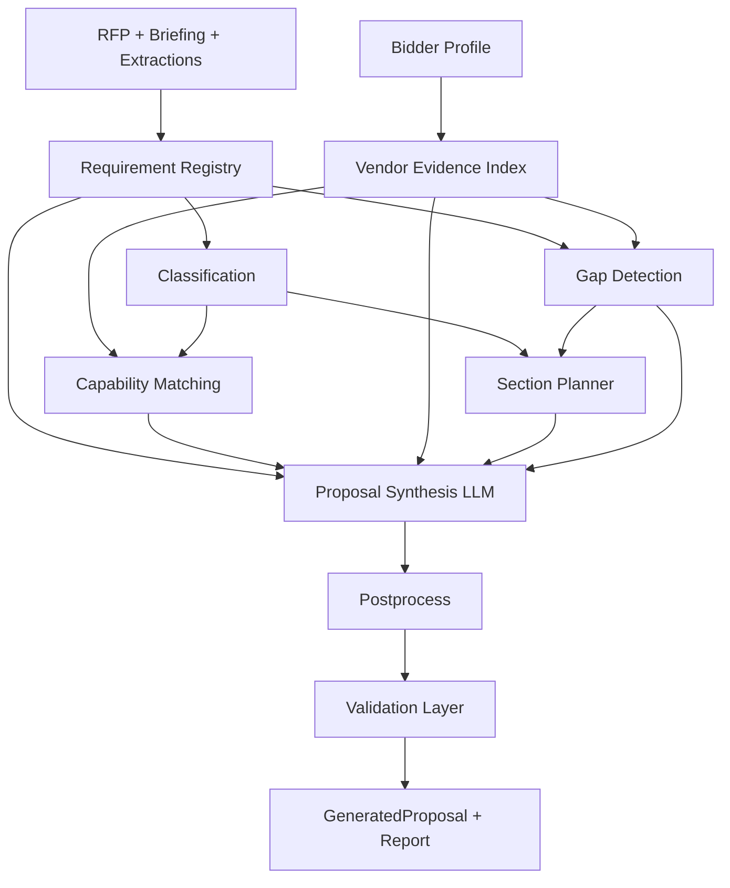

# Enterprise Proposal Generation — Architecture Review & Redesign

This document delivers the 11 requested artifacts for transforming proposal generation from **RFP → LLM → document** into an **evidence-backed, evaluator-grade bid pipeline**.

**Status:** Pipeline v2.0.0 implemented (deterministic pre-stages + validated LLM synthesis). Phases B–C below remain roadmap.

---

## 1. Architecture Review

### Current state (v1 — before redesign)

```
Briefing completed → dump extractions + briefing + 12 chunks + profile → single GPT-4o call → JSON → light postprocess → PDF
```

| Component | Role |
|-----------|------|
| `proposal_service.py` | Single-pass generation |
| `proposal_templates.py` | Monolithic prompt + flat schema |
| `proposal_postprocess.py` | Schema normalization only |
| `proposal_orchestrator.py` | Status lifecycle (no pipeline stages) |
| `proposal_dispatch.py` | Celery/sync thread |
| `proposal_pdf_service.py` | ReportLab render |
| `GeneratedProposal` | `proposal_json` blob only |
| Retrieval | 4 generic Chroma queries, not requirement-scoped |

**Root cause of poor evaluator scores:** The LLM is asked to *write a proposal* and *summarize the RFP* in the same pass, with no structured requirement registry, no evidence index, no methodology enforcement, and no validation that responses explain *how* rather than restate *what*.

### Target state (v2 — implemented foundation)



### Per-component analysis

| File | v1 behavior | Weakness | Hallucination risk | Enterprise gap | Redesign |
|------|-------------|----------|-------------------|----------------|----------|
| `proposal_templates.py` | One-shot JSON schema | Encourages RFP recap; weak anti-echo rules | High — invents ops model | No methodology contract | **v2 prompt** with explicit anti-patterns + pipeline injection |
| `proposal_service.py` | Single LLM call | No pre-computation | Medium | No provenance | **Pipeline context build** before LLM |
| `proposal_postprocess.py` | Dedupe matrix | No echo detection | Marks compliant without evidence | Thin matrix | **Downgrade unjustified compliant → gap** |
| `proposal_orchestrator.py` | CRUD + error handling | No stage tracking | Low | No partial recovery | Future: `proposal_processing` stages |
| `proposal_dispatch.py` | Async dispatch | Fine | Low | — | Unchanged |
| `proposal_pdf_service.py` | Static sections | Missing new sections | Low | No evidence column | **Updated for v2 sections** |
| `GeneratedProposal` | JSON blob | No pipeline artifact storage | — | No audit trail | `_pipeline` + `_meta.validation` in JSON |
| Retrieval | Generic queries | Not per-requirement | Medium | Weak grounding | Future: per-requirement chunk fetch |

---

## 2. Gap Analysis

| Gap | Impact on evaluator score | v2 mitigation | Remaining work |
|-----|---------------------------|---------------|----------------|
| Requirement echo responses | Critical — zero differentiation | Validator `requirement_echo`; prompt anti-patterns | Per-row regeneration on echo |
| Executive summary = RFP recap | Critical — reads as lazy | Prompt rule + section planner purpose | Automated recap detector |
| Thin compliance matrix (3 vs 40+ rows) | Critical — incomplete submission | Registry drives `requirement_count`; prompt mandates all rows | Deterministic matrix pre-fill |
| Invented command centers / headcount | Legal/reputation risk | Evidence index + `[Vendor To Complete]` | Vendor knowledge base uploads |
| Procurement legal risks vs operational | Medium — wrong section | `operational_risks` schema | Risk taxonomy in planner |
| No provenance on vendor claims | Audit failure | `evidence_id` + `source_type` schema | UI evidence viewer |
| No confidence scoring | Bid manager can't triage | `section_confidence` in `_meta` | Per-section regen |
| No vendor KB / case study uploads | Can't scale beyond profile form | Profile-only evidence index | `VendorKnowledgeBase` model |
| Single LLM pass | Context overflow on large RFPs | Pipeline context compressed | Multi-pass section writers |

---

## 3. Improved Proposal Workflow

### Stage 0 — Prerequisites
- Document parsed, briefing `completed`, extractions present.

### Stage 1 — Requirement Registry (`proposal_requirement_registry.py`)
- Pulls items from `technical_requirements`, `scope_of_work`, `mandatory_documents`, `eligibility_criteria`, `evaluation_criteria`, `payment_terms`, `penalties_and_risks`.
- Assigns `requirement_id` (e.g. `STF-01`) and `category` via deterministic keyword + extraction-type routing.

### Stage 2 — Vendor Evidence Index (`proposal_vendor_evidence.py`)
- Flattens profile into `VE-###` records with `source_type`: `SOURCE_VENDOR_PROFILE`, `SOURCE_CERTIFICATION`, `SOURCE_CASE_STUDY`.
- **Rule 1 enforced:** No evidence record → no compliant vendor claim.

### Stage 3 — Capability Matching (`proposal_capability_matcher.py`)
- Token overlap + category-boosted matching of requirements → evidence IDs.
- Emits `suggested_response_angle` (methodology hint, not generic text).

### Stage 4 — Gap Detection (`proposal_gap_detector.py`)
- Cert mismatches (ISO/PSARA in RFP but not profile).
- Missing workforce evidence for staffing requirements.
- Mandatory document flags.
- Pricing gap (always).

### Stage 5 — Section Planner (`proposal_section_planner.py`)
- Base sections + dynamic sections from requirement category histogram.
- Always includes compliance matrix, operational risks, assumptions.

### Stage 6 — Proposal Synthesis (LLM, `PROPOSAL_SYSTEM_PROMPT_V2`)
- Receives full pipeline JSON — **not** raw briefing as primary input.
- Must produce one compliance row per classified requirement.

### Stage 7 — Postprocess (`proposal_postprocess.py`)
- Normalizes v2 matrix fields; downgrades compliant-without-evidence.

### Stage 8 — Validation (`proposal_validator.py`)
- Echo detection (sequence similarity ≥ 72%).
- Unjustified compliance flags.
- Unverified names/certs heuristics.
- Stores `validation` report in `_meta` (does not block save — human triage).

---

## 4. Updated Prompt Strategy

### Principles
1. **Anti-pattern blocklist** in system prompt (echo responses, RFP recap exec summary, legal risks).
2. **Pipeline context is authoritative** — requirements list is the compliance matrix row source.
3. **HOW not WHAT** — every `vendor_response` must describe methodology/controls.
4. **`[Vendor To Complete]`** — standardized placeholder (replaces `[TO BE COMPLETED]`).
5. **Briefing demoted** — evaluation weighting only, not copy source.

### Future: multi-pass prompts
| Pass | Input | Output |
|------|-------|--------|
| A | Registry | Pre-filled matrix skeleton |
| B | Plan + evidence | Section narratives |
| C | Full draft | Polish + consistency |

---

## 5. New Schemas

See `proposal_schemas.py` and `PROPOSAL_OUTPUT_SCHEMA_V2` in `proposal_templates.py`.

### Classified requirement
```json
{
  "requirement_id": "STF-01",
  "category": "STAFFING",
  "requirement": "Provide approximately 275 security personnel",
  "page": 12,
  "section": "Scope of Work",
  "source_text": "verbatim...",
  "extraction_type": "scope_of_work"
}
```

### Evidence record
```json
{
  "evidence_id": "VE-003",
  "source_type": "SOURCE_CERTIFICATION",
  "source_ref": "Bidder Profile — Certification",
  "excerpt": "ISO 9001:2015 — Quality Management",
  "field_path": "certifications[0]"
}
```

### Compliance matrix row (v2)
```json
{
  "requirement_ref": "STF-01",
  "category": "STAFFING",
  "requirement_text": "...",
  "vendor_response": "Three-shift model with 12% float pool... [methodology]",
  "methodology": "Shift rotation + backup pool",
  "evidence": [{"evidence_id": "VE-002", "source_type": "SOURCE_VENDOR_PROFILE", "excerpt": "..."}],
  "compliance_status": "compliant|partial|gap|planned|na",
  "gap_status": "none|vendor_to_complete|rfp_only",
  "confidence_score": 0.82
}
```

### Operational risk
```json
{
  "risk": "Guard attrition during mobilization",
  "likelihood": "medium",
  "impact": "high",
  "mitigation": "Pre-recruited bench of 15%...",
  "owner": "Operations Manager"
}
```

---

## 6. New Retrieval Architecture

### v2 (current)
- Retain 4 broad Chroma queries for supplemental narrative context.
- **Primary grounding** = extraction registry (deterministic).

### v3 (recommended)
```
For each requirement in registry:
  embed(requirement.requirement)
  → Chroma top-3 chunks
  → attach as requirement.rfp_evidence_chunks[]
```
- Separate vendor KB collection (future): `embed(vendor doc chunk)` scoped by tenant.

---

## 7. Validation Layer Design

| Check | Code | Severity | Action |
|-------|------|----------|--------|
| Response echoes requirement | `requirement_echo` | error | Flag in UI; future: regen row |
| Compliant without evidence | `unjustified_compliance` | error | Postprocess downgrades to `gap` |
| Name not in profile | `unverified_person_name` | warning | Bid manager review |
| ISO/cert mention without profile | `unverified_certification` | warning | Require upload |
| Matrix coverage < 80% | `matrix_coverage_ratio` | warning | `_meta` metric |

**Future:** Hard reject (`proposal_status=failed`) when `error_count > N` and `PROPOSAL_STRICT_VALIDATION=True`.

---

## 8. Hallucination Prevention Design

| Claim type | Allowed source | If missing |
|------------|----------------|------------|
| Headcount / scale | Profile or KB excerpt | `[Vendor To Complete]` + `gap` |
| Personnel names | `key_personnel[]` only | Role title only |
| Certifications | `certifications[]` or uploaded cert doc | Gap detector flag |
| Client references | `reference_projects[]` | Omit or placeholder |
| SLA / command center | Profile/KB/policy doc | Do not invent |
| RFP facts | Extractions / chunks | Omit |

**Provenance:** Every vendor claim in JSON should carry `evidence[]` with `evidence_id` resolvable against `_pipeline.evidence_index`.

---

## 9. Compliance Matrix Redesign

| Column | Purpose |
|--------|---------|
| `requirement_ref` | Stable ID from registry |
| `category` | Evaluator filtering |
| `requirement_text` | Verbatim from RFP extraction |
| `vendor_response` | **Methodology** — how we fulfill |
| `methodology` | One-line approach summary |
| `evidence` | Vendor proof objects |
| `compliance_status` | Only `compliant` if evidence present |
| `gap_status` | `vendor_to_complete` when proof missing |
| `confidence_score` | Row-level triage |

**Anti-echo:** Validator compares `requirement_text` ↔ `vendor_response` similarity.

---

## 10. Section Planner Design

Planner reads category histogram from registry:

| Category present | Section added |
|------------------|---------------|
| STAFFING (≥2) | Staffing Approach |
| SECURITY | Service Delivery Model |
| TRAINING | Training Framework |
| TRANSITION | Transition Plan |
| REPORTING | Reporting & KPIs |
| OPERATIONAL | SLA & Operations |

Always: Cover Letter, Executive Summary (value prop), Company Overview, Why Choose Us, Compliance Matrix, Operational Risks, Assumptions & Exclusions.

---

## 11. Code-Level Implementation Recommendations

### Implemented (v2.0.0)
- [x] `proposal_schemas.py`
- [x] `proposal_requirement_registry.py`
- [x] `proposal_vendor_evidence.py`
- [x] `proposal_capability_matcher.py`
- [x] `proposal_gap_detector.py`
- [x] `proposal_section_planner.py`
- [x] `proposal_pipeline_context.py`
- [x] `proposal_validator.py`
- [x] `proposal_templates.py` v2 prompts
- [x] `proposal_service.py` wired to pipeline
- [x] `PROPOSAL_PROMPT_VERSION=2.0.0`
- [x] Frontend validation banner + v2 sections

### v2.1 (implemented — addresses quality gaps)

- **Deterministic compliance matrix** — rows built from registry before LLM; compliance/evidence/gap calculated in Python
- **Methodology templates** — per-category slots (deployment_model, backup_pool_strategy, etc.) assembled deterministically
- **Evaluation weights** — parsed from `evaluation_criteria` extractions; section `emphasis_weight` + `priority`
- **Traceability matrix** — Req ID → Evidence → Section → Status in `_pipeline` and `traceability_matrix`
- **Multi-factor confidence** — evidence_quality × coverage × gap_penalty × validation_penalty
- **Strict validation** — `PROPOSAL_STRICT_VALIDATION=True` fails proposal on echo, unjustified compliance, unsupported certs
- **Knowledge assets schema** — `knowledge_assets` in profile indexed as evidence (policies, SOPs, catalog, etc.)

```env
PROPOSAL_PROMPT_VERSION=2.1.0
PROPOSAL_STRICT_VALIDATION=True
PROPOSAL_MATRIX_DETERMINISTIC=True
PROPOSAL_MATRIX_LLM_REFINE=True
```

### Phase C (enterprise)
1. Human-in-the-loop editing with approval workflow.
2. Evaluator-score simulation (rubric-based self-critique).
3. DOCX export with annexure ordering from `submission_checklist`.
4. Tenant-isolated vendor KB with RLS.

---

## Configuration

```env
PROPOSAL_PROMPT_VERSION=2.0.0
# Future:
# PROPOSAL_STRICT_VALIDATION=False
# PROPOSAL_MATRIX_PREFILL=True
# PROPOSAL_MULTI_PASS=True
```

---

## How to verify improvement

Regenerate a proposal after upgrading. Check `_meta` in API response:

- `requirement_count` — should match extraction volume (not 3).
- `validation.echo_response_count` — target 0.
- `validation.matrix_coverage_ratio` — target ≥ 0.85.
- `section_confidence.compliance_matrix` — higher with fuller profile.
- Executive summary should **not** contain submission deadline recap.

See also [PROPOSAL.md](PROPOSAL.md) for API usage.
